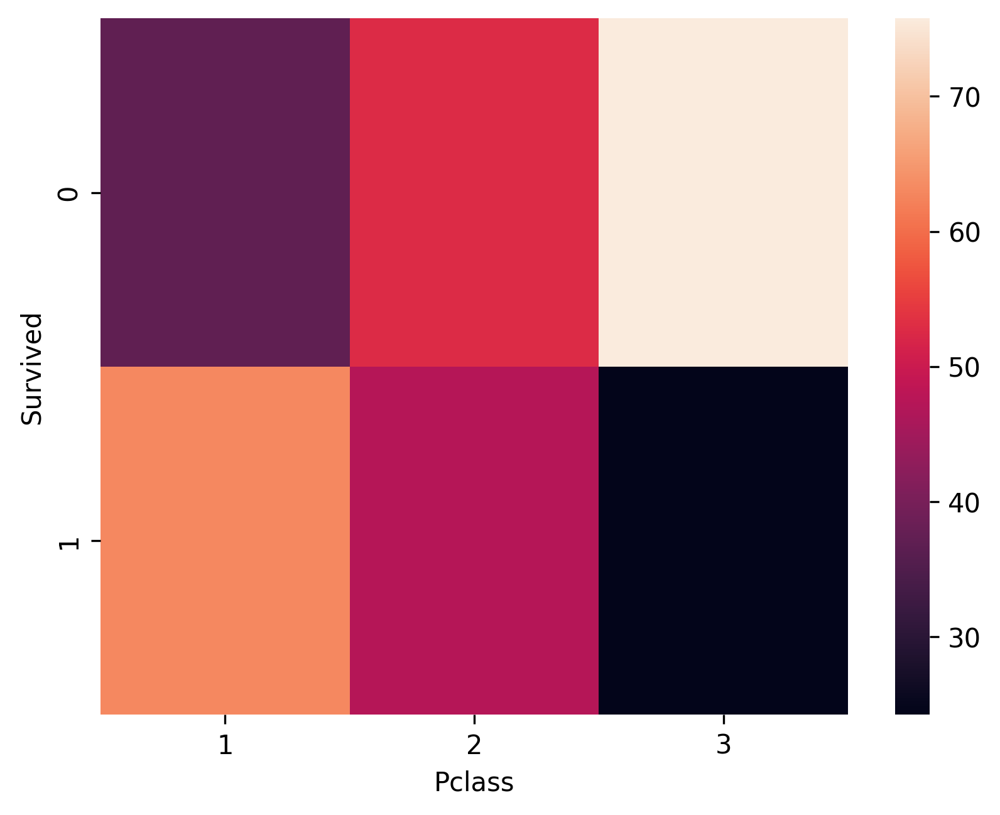
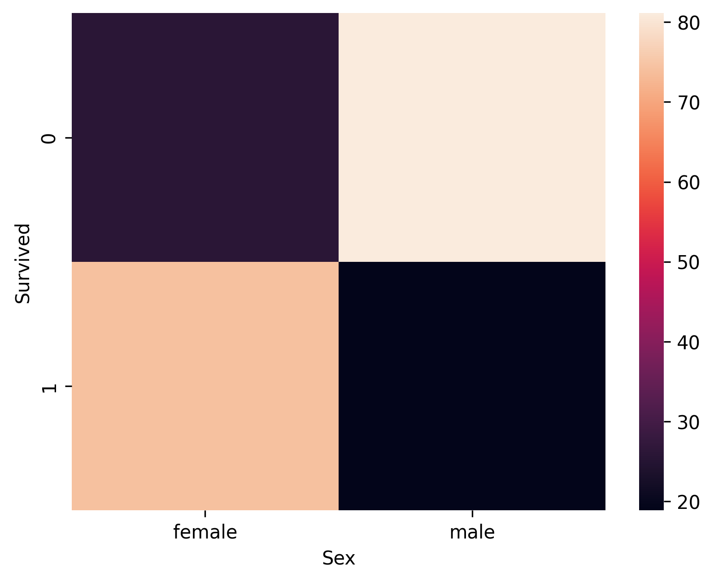
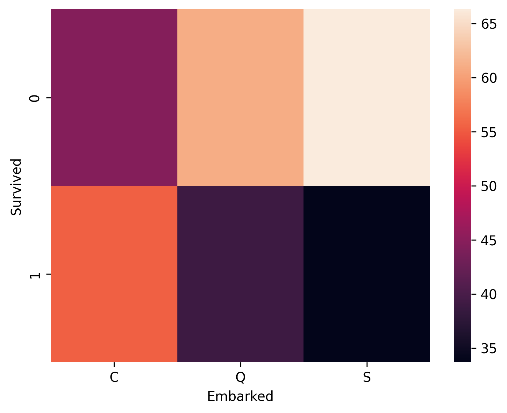
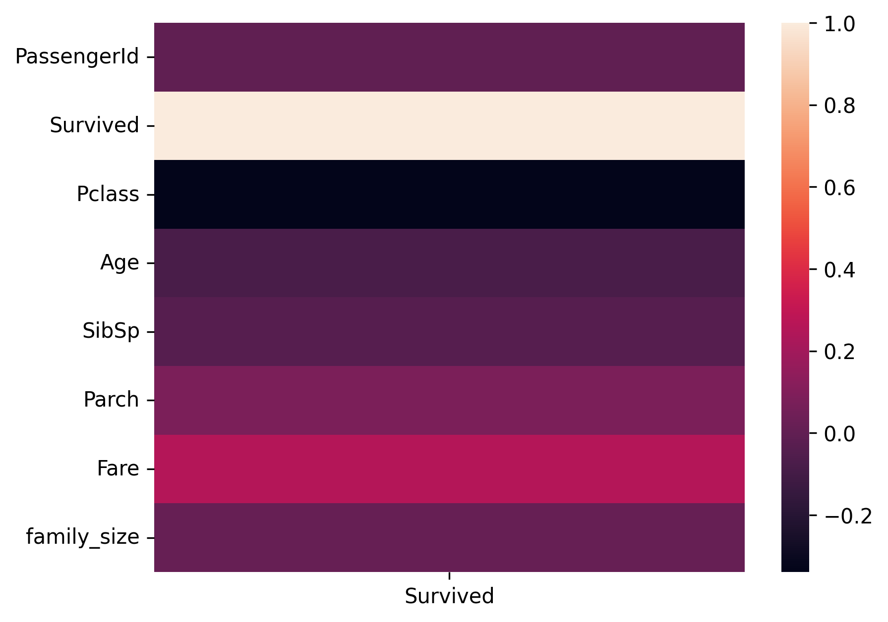

# 🚢 Titanic Dataset: Complete Exploratory Data Analysis & Machine Learning Insights

<div align="center">


**🎯 A comprehensive data science project analyzing passenger survival patterns on the RMS Titanic**

</div>

---

## 🎯 Project Overview

This project presents a **complete exploratory data analysis (EDA)** of the famous Titanic dataset, revealing critical insights into passenger demographics, survival patterns, and socioeconomic factors that influenced survival rates during the tragic 1912 disaster.

### 🔍 What You'll Discover
- **Survival patterns** across different passenger classes and demographics
- **Feature engineering techniques** to extract hidden insights from raw data
- **Statistical relationships** between variables using advanced visualization
- **Data-driven storytelling** that brings historical tragedy to life through numbers

---

## 🏆 Key Findings & Insights

### 💡 **Major Discoveries**

| Finding | Impact | Insight |
|---------|--------|---------|
| **Class Survival Gap** | 1st Class: 63% vs 3rd Class: 24% | Socioeconomic status dramatically affected survival |
| **Gender Disparity** | Women: 74% vs Men: 19% | "Women and children first" protocol was followed |
| **Family Size Effect** | Small families (2-4): Highest survival | Optimal group size for emergency evacuation |
| **Port Differences** | Cherbourg: 55% vs Southampton: 34% | Passenger composition varied by embarkation point |
| **Age Factor** | Children under 15: Higher survival rates | Age-based evacuation priorities were implemented |

### 📊 **Statistical Highlights**
- **Overall Survival Rate**: 38.4% (342 out of 891 passengers)
- **Missing Data**: 20% of age records, 77% of cabin information
- **Feature Engineering**: Created 5 new predictive features from existing data
- **Correlation Analysis**: Identified key survival predictors

---

## 🛠️ Technologies & Tools

<details>
<summary><b>🐍 Python Data Science Stack</b></summary>

- **Pandas** `1.3.0+` - Data manipulation and analysis
- **NumPy** `1.21.0+` - Numerical computations
- **Matplotlib** `3.4.0+` - Static visualizations
- **Seaborn** `0.11.0+` - Statistical data visualization
- **Jupyter Notebook** - Interactive analysis environment

</details>

<details>
<summary><b>📈 Analysis Techniques</b></summary>

- **Univariate Analysis** - Distribution analysis of individual variables
- **Bivariate Analysis** - Correlation and relationship exploration
- **Feature Engineering** - Creating meaningful variables from raw data
- **Statistical Testing** - Cross-tabulation and significance testing
- **Data Visualization** - Heatmaps, KDE plots, box plots, and more

</details>

---

## 📁 Repository Structure

```
titanic-dataset-eda/
│
├── 📊 data/
│   └── raw/                    # Original Kaggle dataset
│       ├── train.csv
│       └── test.csv 
│
├── 📓 notebooks/
│   └── EDA.ipynb
├── 🎨 reports/
│   └── figures/      # High-quality visualizations
├── .gitignore
├── .python-version
├── pyproject.toml
├── README.md
├── uv.lock
└── requirements.txt        # Python dependencies
```

---

## 🚀 Quick Start

### 1️⃣ **Clone Repository**
```bash
git clone https://github.com/ZohaibCodez/titanic-dataset-eda.git
cd titanic-dataset-eda
```

### 2️⃣ **Setup Environment**
```bash
# Create virtual environment
python -m venv venv
source venv/bin/activate  # On Windows: venv\Scripts\activate

# Install dependencies
pip install -r requirements.txt
```

### 3️⃣ **Launch Analysis**
```bash
# Start Jupyter Notebook
jupyter notebook

# Open the main analysis file
# notebooks/01_data_exploration.ipynb
```

---

## 📊 Visualizations & Results

<div align="center">

### 🏛️ **Survival by Passenger Class**
<div align="center">

</div>

*Clear correlation between socioeconomic status and survival rates*

### 👨‍👩‍👧‍👦 **Gender-Based Survival Analysis** 
<div align="center">

</div>

*Gender disparity in survival rates - "Women and children first" protocol*

### 🗺️ **Geographic Survival Patterns**
<div align="center">

</div>

*Different survival rates by embarkation port and passenger composition*

### 🔗 **Correlation Analysis**
<div align="center">

</div>

*Comprehensive correlation analysis showing relationships with survival*

</div>

> **💡 Pro Tip**: All visualizations are saved as high-resolution PNG files in `reports/figures/` for presentations and reports.

---

## 🔬 Methodology & Approach

### **Phase 1: Data Understanding**
- Dataset overview and structure analysis
- Missing value identification and assessment
- Initial data quality evaluation

### **Phase 2: Univariate Analysis** 
- Distribution analysis for numerical variables
- Frequency analysis for categorical variables
- Outlier detection and handling strategies

### **Phase 3: Bivariate Analysis**
- Correlation analysis between variables
- Cross-tabulation for categorical relationships
- Statistical significance testing

### **Phase 4: Feature Engineering**
- Family size calculation from SibSp + Parch
- Title extraction from passenger names
- Cabin deck level extraction
- Family type categorization

### **Phase 5: Advanced Insights**
- Multi-dimensional relationship exploration
- Pattern identification and validation
- Business insight generation

---

## 📚 Learning Outcomes

**🎓 Skills Demonstrated:**
- **Data Cleaning** - Handling missing values and inconsistent data
- **Feature Engineering** - Creating meaningful variables from raw data
- **Statistical Analysis** - Understanding distributions and relationships
- **Data Visualization** - Creating compelling and informative charts
- **Storytelling** - Translating data into actionable insights

**💼 Business Applications:**
- Risk assessment and prediction modeling
- Customer segmentation analysis
- Historical event analysis
- Emergency response planning

---

## 🤝 Contributing

Contributions are welcome! Here's how you can help:

1. **🍴 Fork** the repository
2. **🌿 Create** a feature branch (`git checkout -b feature/amazing-analysis`)
3. **💾 Commit** your changes (`git commit -m 'Add amazing analysis'`)
4. **📤 Push** to the branch (`git push origin feature/amazing-analysis`)
5. **🔄 Open** a Pull Request

### 📝 **Areas for Enhancement:**
- Advanced statistical testing (chi-square, ANOVA)
- Machine learning model implementation
- Interactive visualizations with Plotly
- Predictive modeling and validation

---

## 📄 License

This project is licensed under the **MIT License** - see the [LICENSE](LICENSE) file for details.

---

## 👤 Author

**Zohaib Khan**
- 🌐 **Portfolio**: [ZohaibCodez](https://zohaibcodez.github.io/DS-Portfolio/)
- 💼 **LinkedIn**: [linkedin.com/in/ZohaibCodez](https://linkedin.com/in/ZohaibCodez)
- 🐙 **GitHub**: [@ZohaibCodez](https://github.com/ZohaibCodez)
- 📧 **Email**: itxlevicodez@gmail.com

---

## 🙏 Acknowledgments

- **Kaggle** for providing the Titanic dataset
- **Seaborn/Matplotlib** teams for excellent visualization libraries
- **Python Data Science Community** for continuous inspiration
- **Historical researchers** who documented the Titanic tragedy

---

## ⭐ Show Your Support

If this project helped you learn something new or provided value, please consider:

- ⭐ **Starring** this repository
- 🍴 **Forking** for your own experiments
- 📱 **Sharing** on social media
- 💬 **Opening issues** for discussions

**🚀 Let's connect and build amazing data science projects together!**

---

<div align="center">

**📊 Data Science • 🐍 Python • 📈 Machine Learning • 🎯 Portfolio Project**

*Built with 🖤 for the data science community*

</div>
